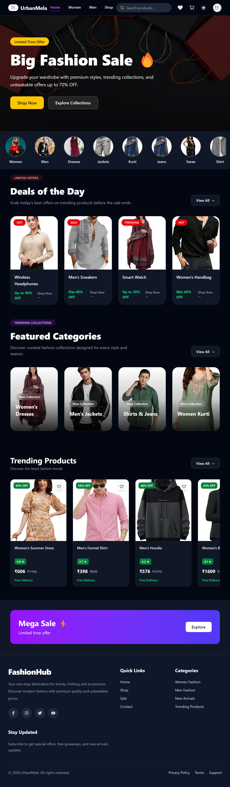
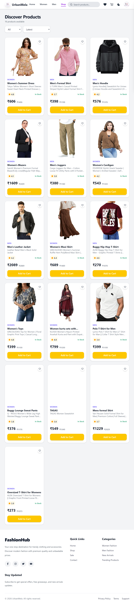
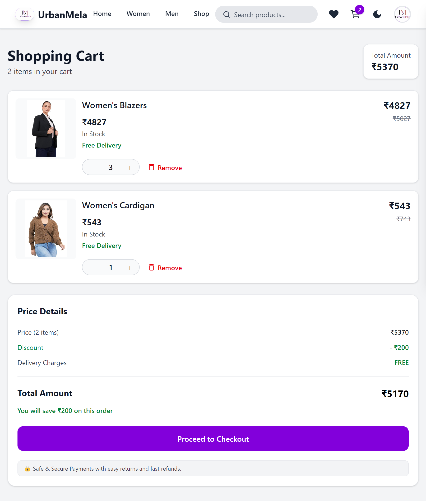
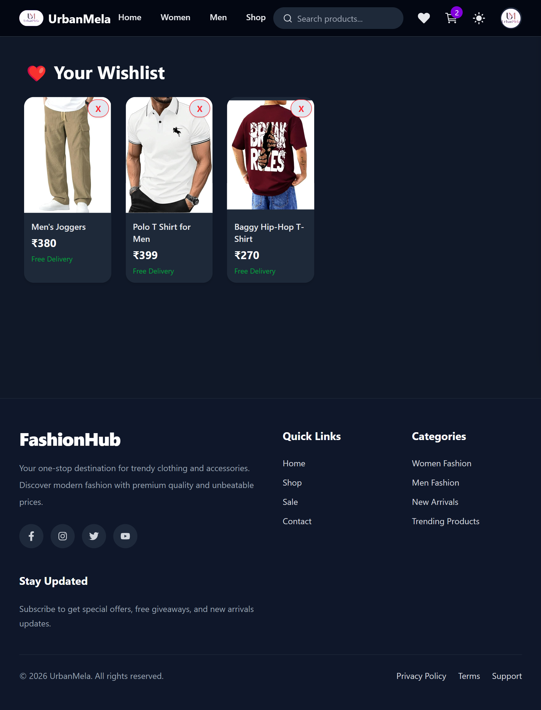
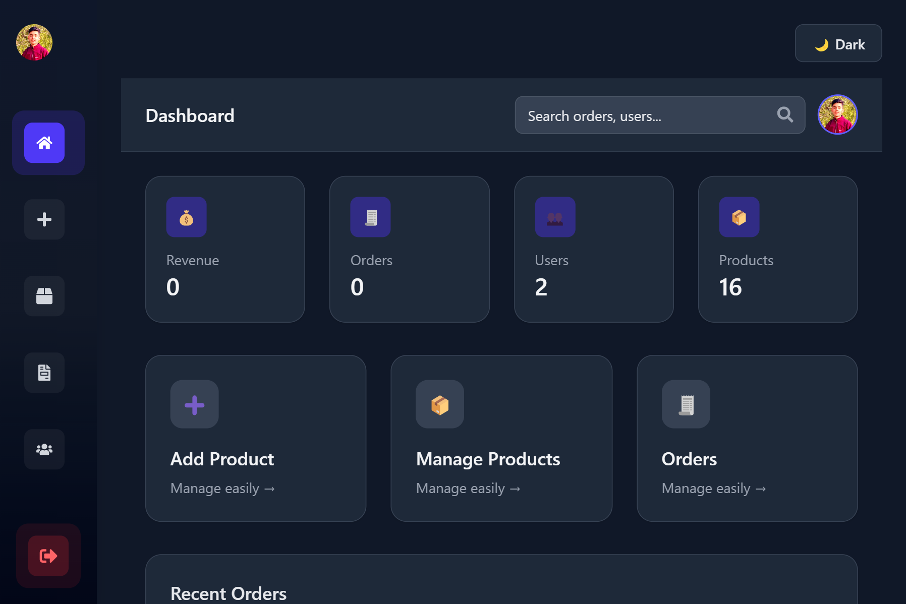

# 🛒 Meesho Clone - MERN E-Commerce Application

A full-stack e-commerce application inspired by Meesho, built using the MERN stack. The application provides a seamless shopping experience with authentication, product management, cart functionality, wishlist management, and order processing.

## 🚀 Features

### User Features

* User Registration & Login
* Google Authentication
* Browse Products
* Product Search
* Product Details Page
* Add to Cart
* Update Cart Quantity
* Wishlist Management
* Place Orders
* Order History
* Responsive Design
* Order Tracking

### Admin Features

* Add Products
* Update Products
* Delete Products
* Manage Orders
* Manage Inventory

## 🛠 Tech Stack

### Frontend

* React.js
* Vite
* React Router
* Axios
* Tailwind CSS

### Backend

* Node.js
* Express.js
* JWT Authentication
* Cookie-based Authentication
* Multer (Image Uploads)

### Database

* MongoDB Atlas
* Mongoose

## 📂 Project Structure

E-COMMERCE/
│
├── client/          # React Frontend
├── server/          # Express Backend
├── uploads/         # Product Images
└── README.md
```

## ⚙️ Installation

### Clone Repository

```bash
git clone https://github.com/anmolsharma3843/meesho-clone.git
cd meesho-clone
```

### Install Frontend Dependencies

cd client
npm install

### Install Backend Dependencies

cd ../server
npm install

## 🔐 Environment Variables

Create a .env file in the backend directory:


PORT=5000
MONGO_URI=your_mongodb_connection_string
JWT_SECRET=your_jwt_secret
CLIENT_URL=http://localhost:5173


Create a .env file in the frontend directory:

VITE_API_URL=http://localhost:5000

## ▶️ Run Locally

### Backend


cd server
npm run dev


### Frontend

cd client
npm run dev


## 🌐 Live Demo

Frontend: Coming Soon

Backend: Coming Soon

## 📸 Screenshots

Add screenshots of:

### Home Page



### Product Page



### Cart Page



### Wishlist Page



### Admin Page



## 🔮 Future Improvements

* Payment Gateway Integration
* Product Reviews & Ratings
* Email Notifications
* Advanced Product Filters

## 👨‍💻 Author

Anmol Sharma

LinkedIn: www.linkedin.com/in/anmol-sharma-a40144388


GitHub: https://github.com/anmolsharma3843-coder
